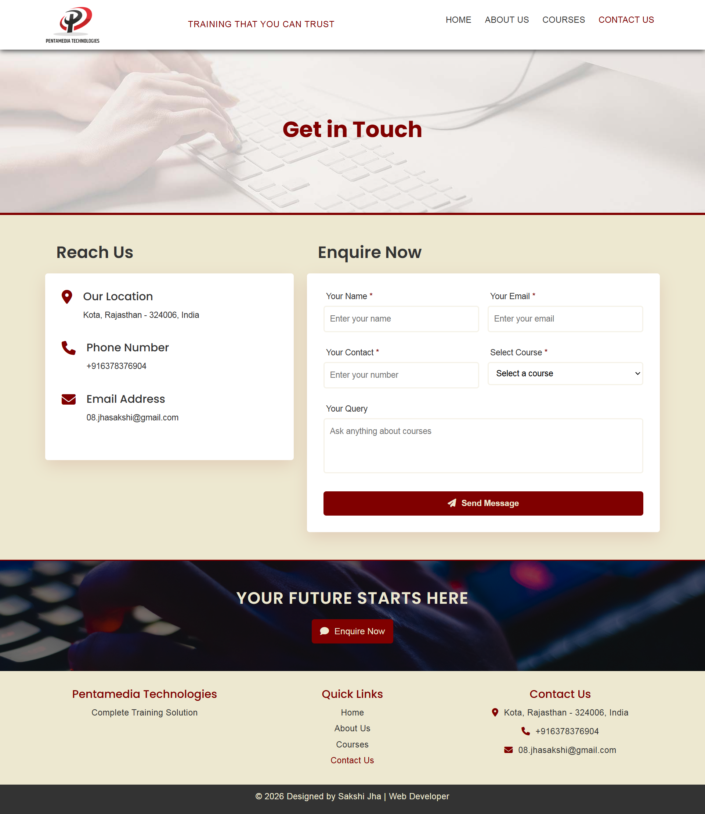
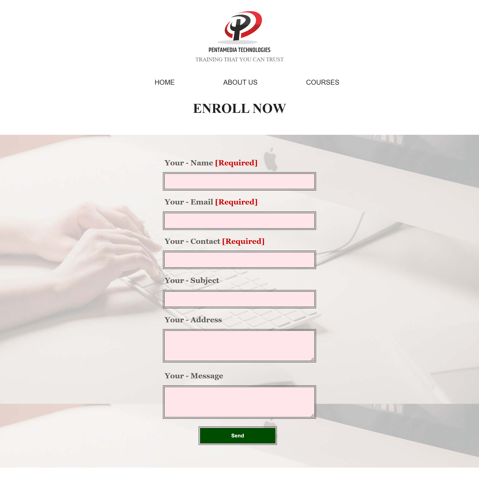

## Training Institute Website (Responsive Web Application)
> 🔄 This project demonstrates the transition from a basic static website to a dynamic, modular web application.
A fully responsive and modular training institute website developed using HTML5, CSS3, JavaScript, Bootstrap 5, and PHP with MySQL database integration. This project was initially built during my diploma and later upgraded with improved UI, modular architecture, and backend functionality.

## 🚀 Features
- Fully responsive design (mobile, tablet, desktop)
- Multi-page website (Home, About Us, Courses, Contact Us)
- Modular architecture using reusable components (header, footer, head)
- Dynamic page-based CSS and JavaScript loading
- Interactive UI components:
    * Counter animation using Intersection Observer
    * Accordion (toggle system)
    * Responsive navigation menu
- PHP-based contact/enquiry form with MySQL database integration
- Dynamic dropdown in contact form populated from MySQL database using PHP
- Popup feedback messages (success/error handling)
- SEO optimization using meta tags, canonical URLs, and Open Graph

## 🛠️ Technologies Used
- HTML5
- CSS3 (Flexbox, Grid, Animations, Responsive Design)
- JavaScript (DOM manipulation, events, Intersection Observer)
- Bootstrap 5
- PHP (Modular backend development)
- MySQL (Database)

## 📁 Project Structure
```
training-institute-website/
│
├── backend/                # Form handling logic
├── config/                 # Database configuration
├── includes/               # Reusable components (header, footer, head)
├── css/                    # Modular stylesheets (page-wise)
├── js/                     # Common and page-specific scripts
├── images/                 # Organized images (page-wise)
├── screenshots/            # Project screenshots (updated + old versions)
│
├── index.php
├── about.php
├── courses.php
├── contact.php
│
└── README.md
```

## 📸 Screenshots
### 🔹 Updated Version



### 🕰️ Previous Version (Before Improvements)




## 🔄 Project Improvement
This project was later enhanced with better UI design, modular code structure, responsive improvements, and backend integration using PHP and MySQL.

## 📌 Future Improvements
- Add form validation and security enhancements (prepared statements)
- Build admin panel to manage enquiries and courses
- Deploy project on live server
- Improve UI with modern design system

## 👩‍💻 Author
**Sakshi Jha**  
Web Developer